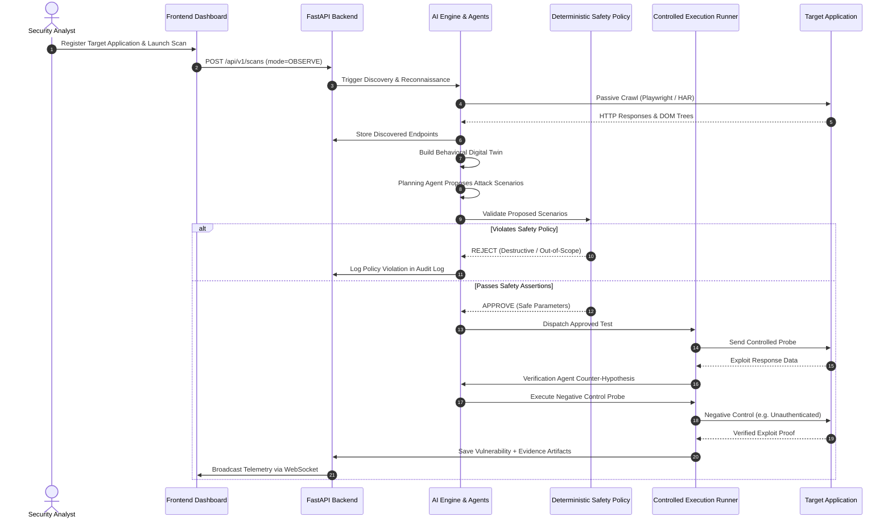

# PHANTOM-X — End-to-End Data Flow

```mermaid
sequenceDiagram
    autonumber
    actor Operator as Security Analyst
    participant Frontend as Frontend Dashboard
    participant Backend as FastAPI Backend
    participant AI as AI Engine & Agents
    participant Policy as Deterministic Safety Policy
    participant Runner as Controlled Execution Runner
    participant Target as Target Application

    Operator->>Frontend: Register Target Application & Launch Scan
    Frontend->>Backend: POST /api/v1/scans (mode=OBSERVE)
    Backend->>AI: Trigger Discovery & Reconnaissance
    AI->>Target: Passive Crawl (Playwright / HAR)
    Target-->>AI: HTTP Responses & DOM Trees
    AI->>Backend: Store Discovered Endpoints
    AI->>AI: Build Behavioral Digital Twin
    AI->>AI: Planning Agent Proposes Attack Scenarios
    AI->>Policy: Validate Proposed Scenarios
    alt Violates Safety Policy
        Policy-->>AI: REJECT (Destructive / Out-of-Scope)
        AI->>Backend: Log Policy Violation in Audit Log
    else Passes Safety Assertions
        Policy-->>AI: APPROVE (Safe Parameters)
        AI->>Runner: Dispatch Approved Test
        Runner->>Target: Send Controlled Probe
        Target-->>Runner: Exploit Response Data
        Runner->>AI: Verification Agent Counter-Hypothesis
        AI->>Runner: Execute Negative Control Probe
        Runner->>Target: Negative Control (e.g. Unauthenticated)
        Target-->>Runner: Verified Exploit Proof
        Runner->>Backend: Save Vulnerability + Evidence Artifacts
        Backend->>Frontend: Broadcast Telemetry via WebSocket
    end
```

